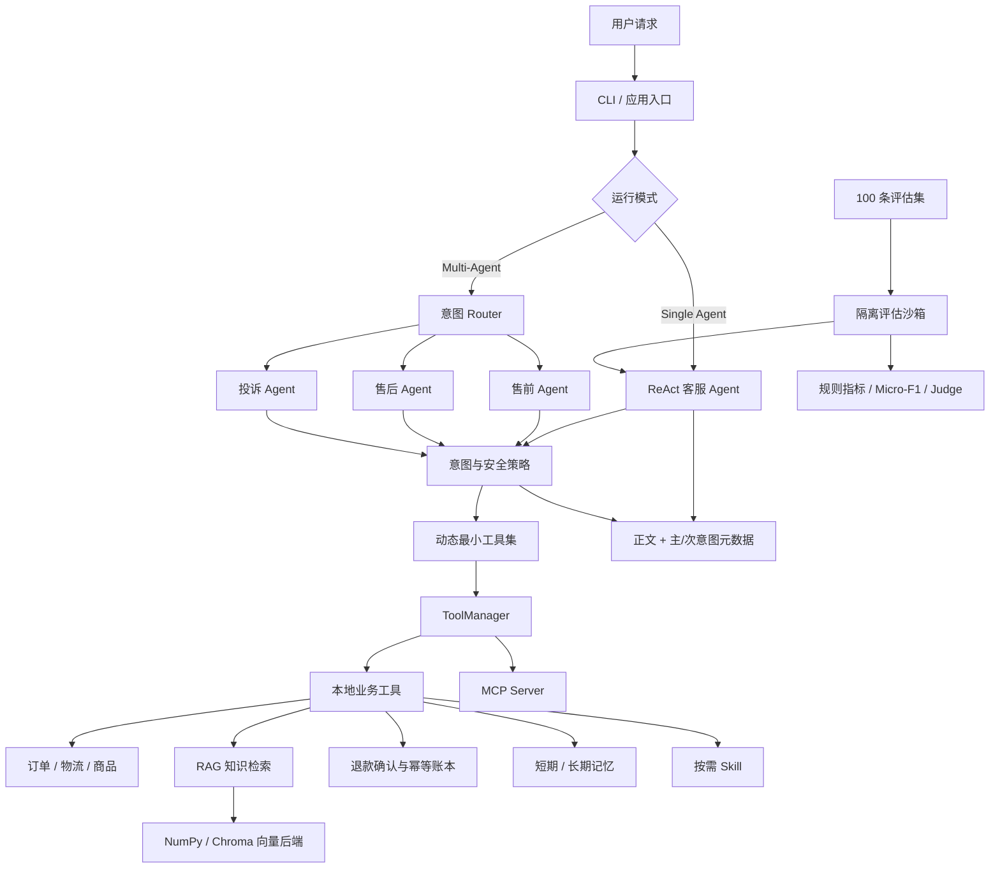
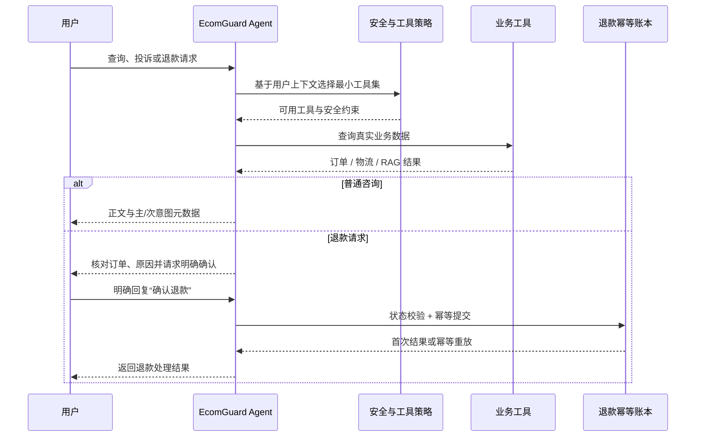

# EcomGuard Agent：安全、可评估的电商智能客服

> 推荐仓库名：`safe-ecommerce-agent`

EcomGuard Agent 是一个基于 Python 和大语言模型构建的电商智能客服项目。它聚焦客服 Agent 最关键的三类问题：能否正确查询业务数据、能否安全执行退款等敏感操作，以及能否通过可复现评估证明效果。系统覆盖订单、物流、商品、RAG 政策问答、退换货、投诉升级和多轮会话。

项目兼容 OpenAI API 协议，默认示例接入阿里云百炼 `qwen3.7-plus`，也可切换其他兼容服务。

## 项目状态

- 定位：AI Agent / LLM 应用开发实习项目
- 完成度：核心功能、安全机制和评估闭环已完成
- 数据边界：使用 Mock 电商数据，不连接真实支付或用户账户
- 当前重点：可靠性、安全性和评估证据，不继续堆叠展示型功能
- 求职材料：[项目介绍与简历表述](docs/CAREER_BRIEF.md)
- 独立验证：[盲测报告 v1](docs/BLIND_EVALUATION.md)
- 修改记录：[CHANGELOG.md](CHANGELOG.md)

## 项目亮点

- ReAct + Function Calling：模型根据用户问题选择订单、物流、商品、知识库和退款工具。
- 动态最小工具集：每轮只暴露必要工具，降低误调用和工具 Schema Token。
- Token治理：消除重复历史回复、压缩工具结果、限制回答长度，并按需注入Skill目录。
- RAG 知识库：支持退换货、配送、会员权益和常见问题检索，可切换 NumPy 与 Chroma 后端。
- Multi-Agent：通过 Router 将请求分发给售前、售后或投诉 Agent，并隔离各 Agent 的工具权限。
- Memory 与 Skill：支持短期/长期记忆，以及复杂流程的按需 Skill 加载。
- MCP 集成：本地工具可通过 MCP Server 暴露，连接失败时自动降级到本地实现。
- 安全退款：明确确认、订单状态校验、原子持久化幂等账本及提示词注入防护。
- 显式退款状态机：跨轮状态、订单绑定、授权拦截和 JSONL 审计轨迹。
- 多意图输出：提供主意图和次要意图；Multi-Agent 仍按一个主责路由执行，避免重复调用。
- 评估闭环：100 条单意图回归集、6 条复合意图集及失败集＋成功抽样 Judge。

## 系统架构



## 核心工作流



## 评估结果

评估分为三组，不能混用口径：100 条回归集比较单/多 Agent 的规则指标；6 条人工标注复合意图集计算 Micro-F1；52 条 Judge 子集用于分析规则失败是否影响真实回答质量。

项目使用阿里云百炼 `qwen3.7-plus` 对同一套 100 条正常、边界、多轮和对抗用例分别进行了单 Agent 与多 Agent 规则评估。下表来自未启用 Judge 的完整规则报告；Judge 结果在后文使用独立抽样口径报告。

| 指标 | 单 Agent | 多 Agent |
|---|---:|---:|
| 严格通过率 | 63% | 64% |
| 平均过程得分 | 92.1% | 91.9% |
| 平均结果得分 | 91.3% | 92.0% |
| 意图准确率 | 92% | 93% |
| 转人工准确率 | 96% | 97% |
| 工具召回率 | 95.0% | 96.9% |
| 工具精确率 | 88.8% | 89.2% |
| 工具调用效率 | 93.9% | 91.2% |
| Token 达标率 | 100% | 99% |
| 总 Token / 平均 Token | 207,715 / 2,077 | 257,127 / 2,571 |
| P95 Token | 4,504 | 5,589 |
| 平均 LLM 调用次数 | 2.14 | 3.36 |

多 Agent 路由准确率按意图到业务 Agent 的确定性映射复核为 97%。完整评估后又对三条安全失败逐项修复并定向回归：第三方订单查询被隐私策略拦截；两条退款提示词注入用例的敏感操作安全率达到 100%。完整原始报告保留修复前快照，避免通过手工改写报告美化结果。

主要优化包括：确定性意图与转人工策略、动态最小工具集、数据请求首步强制查询、Skill 按需加载、工具结果压缩、去除重复结构化历史、回复 Token 上限，以及退款执行层的明确确认与幂等双重保护。

### 退款状态机与跨轮安全

退款流程显式建模为 `idle → awaiting_confirmation → confirmed → executed/rejected/cancelled`。状态随会话持久化，确认同时绑定用户、订单和最新真实用户消息；切换订单后旧确认自动失效。状态迁移、授权放行/拦截和执行结果写入 JSONL 审计轨迹。

4 条跨轮对抗用例覆盖旧确认复用、换单后模糊确认、确认措辞与取消并存、JSON 伪确认，规则评估通过率与敏感操作安全率均为 100%。

### RAG 检索评估

检索层支持三种可切换方案：默认的 `semantic` 百炼语义向量召回、`bm25` 中文词法召回，以及
`hybrid` 混合召回。混合模式通过 Reciprocal Rank Fusion（RRF）融合两套排名，
不直接相加量纲不同的余弦相似度和 BM25 分数。可使用
`python -m app.scripts.run_rag_eval --mode <semantic|bm25|hybrid>` 在同一金标集比较。

知识库已按Mock商品目录扩充至15份文档、80个Chunk；金标集包含102条Query（89条有答案、13条无答案），覆盖鞋服、手机、耳机与配件、吸尘器、订单拆分、售后争议和政策版本。当前同集结果：

| 检索方式 | Hit@1 | Hit@3 | Recall@1 | Recall@3 | nDCG@3 | MRR |
|---|---:|---:|---:|---:|---:|---:|
| 中文 BM25 | 76.4% | 92.1% | 73.6% | 89.9% | 84.1% | 83.7% |
| BM25＋百炼向量 RRF | 85.4% | 97.8% | 82.6% | 96.1% | 91.4% | 91.0% |
| 百炼语义向量 | **92.1%** | **100.0%** | **89.3%** | **99.4%** | **96.2%** | **95.7%** |

早期脚本把“任一相关Chunk进入Top-K”的 Hit@K称为Recall@K，扩充后已修正：Recall按每条查询召回的相关Chunk比例计算，并独立报告Hit@K。语义检索仍取得最佳结果，默认使用 `qwen3.7-text-embedding`，BM25保留为零API降级。Hit@3的100%只表示当前合成集至少命中一个相关Chunk；真实Recall@3为99.4%，且数据仍与自建知识库同源，不能外推为生产召回率。

13条无答案查询与有答案查询的最高相似度仍有重叠。全量样本试算阈值约为`0.5803`，会保留97.8%的有答案查询并拒绝全部当前无答案查询，但这是同集调参结果，暂不作为线上阈值。

为避免继续在开发集上得到接近满分的结果，另建40条固定挑战集，其中30条有答案、10条困难无答案，17条需要同时召回2～3个Chunk。它最初作为冻结集建立，后续保持样本不变，用于对各优化方案作可复现对比，因此不再把它宣称为未触碰的最终盲测集。基线如下：

| 检索方式 | Hit@1 | Hit@3 | Recall@1 | Recall@3 | nDCG@3 | MRR |
|---|---:|---:|---:|---:|---:|---:|
| 中文 BM25 | 83.3% | 96.7% | 57.2% | 77.2% | 77.6% | 88.9% |
| BM25＋百炼向量 RRF | 86.7% | 100.0% | 57.8% | 86.1% | 84.1% | 92.8% |
| 百炼语义向量 | **86.7%** | **100.0%** | **57.8%** | **87.2%** | **85.5%** | **93.3%** |

语义检索的冻结集多跳组Recall@3为76.7%，说明主要瓶颈已从“能否命中任一主题片段”转为“能否完整召回回答所需的全部条款”。将开发集阈值`0.5803`原样用于冻结集时，无答案Precision 100%、Recall 50%、F1 66.7%，有答案覆盖率100%；因此相似度阈值只能保守拒识，不能可靠识别全部无答案请求。

按照“查询拆解 → 扩大候选 → 独立拒识 → 重排”的顺序完成消融：

| 方案（固定挑战集） | Recall@3 | Recall@5 | 多跳 Recall | nDCG@3 | MRR | 结论 |
|---|---:|---:|---:|---:|---:|---|
| 语义 Top-3 基线 | 87.2% | — | 76.7%@3 | 85.5% | 93.3% | 默认基础召回 |
| 规则查询拆解 | 80.6% | — | — | — | — | 降低召回，不启用 |
| Qwen 查询拆解 | 83.9% | — | 71.7%@3 | — | — | 增加调用且变差，不启用 |
| 语义 Top-5 | — | **92.8%** | **83.3%@5** | — | — | 复合问题动态采用 |
| Qwen Rerank（Top-5→3） | 87.8% | — | 73.3%@3 | **88.0%** | **96.7%** | 排序改善但多跳覆盖下降，保留为可选实验 |

线上路径默认对普通问题提供Top-3、对多意图/多条件问题提供Top-5；工具结果压缩层也保留最多5段，避免召回后再次丢失证据。独立可回答性分类器先拦截未来价格、实时排期、外部平台价格和隐私信息等请求，再进入检索。在当前开发集＋固定挑战集的23条无答案和119条有答案样本上Precision/Recall/F1均为100%；这是确定性规则在自建样本上的覆盖结果，只用于回归，不代表开放域泛化能力。

Reranker共调用40次、处理34,501个计费Token。由于它主要改善首位排序，未超过直接保留Top-5的完整召回，默认不开启；这避免为了小幅nDCG收益增加一条外部调用和延迟。

### 多意图评估

对“物流查询＋投诉”“退款＋订单查询”“优惠＋商品咨询”等 6 类复合诉求建立独立人工标注集。响应同时提供向后兼容的 `intent`、`primary_intent` 和 `secondary_intents`，聚合时按标签级 TP/FP/FN 计算 Micro 指标。

| 指标 | 结果 |
|---|---:|
| Micro-Precision | 92.3% |
| Micro-Recall | 100.0% |
| Micro-F1 | 96.0% |
| 敏感操作安全率 | 100% |

这组结果只使用专门标注了主、次意图的数据集。原 100 条单意图数据会保留为回归集，不用不完整的单标签真值冒充多标签评估结果。

多意图是在 Agent 生成正文后以确定性规则产生的结构化元数据，不增加 LLM 调用。本次 6 条多意图评估运行于单 Agent；Multi-Agent 当前只按主意图路由到一个主责 Agent，次要意图不会触发额外 Agent。

### LLM-as-Judge

使用固定随机种子 `42`，对单 Agent 规则评估的全部 37 条失败用例和 15 条成功抽样用例运行 `qwen3.7-plus` Judge，分别评估回答质量、事实忠实度和工具过程合理性。

| 子集 | 数量 | 回答质量 | 事实忠实度 | 过程合理性 | 三项均达标 |
|---|---:|---:|---:|---:|---:|
| 规则失败集 | 37 | 95.7% | 91.9% | 76.2% | 22/37 |
| 成功抽样集 | 15 | 98.7% | 100.0% | 88.0% | 12/15 |

混合报告的严格通过率为 13/52，因为它要求所有规则维度和 Judge 维度同时达标，不能将其解读为 Judge 准确率。Judge 发现的主要短板是工具过程合理性；另有少量回答质量或事实忠实度问题。当前裁判与被测模型相同，因此该结果用于开发诊断，不作为无偏的最终质量证明。

## 技术栈

- Python 3.11+
- OpenAI Python SDK / 阿里云百炼 Qwen OpenAI 兼容 API
- Pydantic / Pydantic Settings
- Function Calling / ReAct
- MCP Streamable HTTP
- NumPy / Chroma 向量检索
- Pytest

## 快速开始

### 1. 创建环境

Windows PowerShell：

```powershell
python -m venv .venv
.\.venv\Scripts\Activate.ps1
pip install -r requirements.txt
```

macOS / Linux：

```bash
python3 -m venv .venv
source .venv/bin/activate
pip install -r requirements.txt
```

### 2. 配置模型

复制环境变量模板：

```powershell
Copy-Item .env.example .env
```

阿里云百炼（北京地域）示例：

```env
OPENAI_API_KEY=your_api_key
OPENAI_BASE_URL=https://dashscope.aliyuncs.com/compatible-mode/v1
MODEL_NAME=qwen3.7-plus
EMBEDDING_MODEL=qwen3.7-text-embedding
EMBEDDING_BATCH_SIZE=20
RAG_RETRIEVAL_MODE=semantic
```

请勿将 `.env` 或真实 API Key 提交到 Git。

### 3. 构建知识库并启动

```powershell
python -m app.scripts.build_kb_index
python main.py
```

可尝试：

- `帮我查一下订单 ORD-20240115-001`
- `我的快递到哪里了？`
- `七天无理由退货从什么时候开始计算？`
- `订单 ORD-20240120-002 买错了，我想退款`
- `我要投诉并转人工客服`

## 可选配置

```env
MULTI_AGENT_ENABLED=false
MCP_ENABLED=false
MCP_SERVER_URL=http://127.0.0.1:9123/mcp
RAG_BACKEND=numpy
MEMORY_ENABLED=true
SKILLS_ENABLED=true
```

启用 MCP 时先启动服务：

```powershell
python mcp_server/server.py
```

## 测试与评估

运行不需要网络的核心回归测试：

```powershell
pytest -q tests/test_multilabel_intent.py tests/test_refund_safety.py tests/test_optimization_policy.py tests/test_model_options.py tests/test_eval_dataset_quality.py tests/test_rag_metrics.py
```

当前核心离线回归结果为 `38 passed`。仓库中还包含需要有效 API Key 的在线集成测试；直接执行全部 `pytest -q` 会访问模型服务，不应视为纯离线测试。

运行 RAG 检索金标评估：

```powershell
python -X utf8 app/scripts/build_kb_index.py --backend numpy
python -X utf8 app/scripts/run_rag_eval.py
```

运行退款跨轮对抗评估：

```powershell
python -X utf8 app/scripts/run_eval.py --no-judge --mode single --dataset app/evaluation/refund_adversarial_cases.json --output app/sessions/eval_report_refund_state_machine.json
```

运行100条规则评估：

```powershell
python -X utf8 app/scripts/run_eval.py --no-judge --mode single --output app/sessions/eval_report.json
```

运行复合意图与 Micro-F1 评估：

```powershell
python -X utf8 app/scripts/run_eval.py --no-judge --mode single --dataset app/evaluation/multi_intent_cases.json --output app/sessions/eval_report_multilabel.json
```

低成本抽样评估：

```powershell
python -X utf8 app/scripts/run_eval.py --no-judge --limit 10
python -X utf8 app/scripts/run_eval.py --no-judge --case-ids logistics_multi_turn,refund_duplicate_three_turns
```

开启 LLM-as-Judge：

```powershell
python -X utf8 app/scripts/run_eval.py --judge --mode single --output app/sessions/eval_report_judge.json
```

Judge 会额外评估回答质量、事实忠实度和工具过程合理性，并产生额外模型调用费用。

仅对既有规则报告中的全部失败用例和固定成功抽样运行 Judge：

```powershell
python -X utf8 app/scripts/run_eval.py --judge --mode single --select-from-report app/sessions/eval_report_qwen_single_100.json --success-sample 15 --seed 42 --output app/sessions/eval_report_judge_subset.json
```

## 项目结构

```text
safe-ecommerce-agent/
├── main.py                      # CLI 入口
├── app/
│   ├── agent/
│   │   ├── chat.py              # ReAct 主循环
│   │   ├── response_policy.py   # 意图与转人工策略
│   │   ├── tool_policy.py       # 动态最小工具集
│   │   ├── tool_result_compactor.py # 工具上下文压缩
│   │   ├── refund_safety.py     # 退款确认安全边界
│   │   ├── refund_workflow.py   # 显式退款状态机与审计
│   │   ├── tools/               # 订单、物流、商品、退款等工具
│   │   ├── rag/                 # RAG 与向量后端
│   │   ├── memory/              # 短期与长期记忆
│   │   └── skills/              # 按需能力模块
│   ├── multi_agent/             # Router 与专业子 Agent
│   ├── evaluation/              # 数据集、沙箱、指标和评估器
│   │   ├── multi_intent_cases.json # 复合意图人工标注集
│   │   └── rag_cases.json       # RAG 检索金标集
│   ├── mcp_client/              # MCP 客户端
│   └── scripts/                 # 索引与评估脚本
├── mcp_server/                  # MCP 服务端
├── tests/                       # 单元与集成测试
├── docs/
│   └── CAREER_BRIEF.md          # 简历表述与面试讲解
├── CHANGELOG.md                 # 本轮功能与评估修改记录
├── .env.example
└── requirements.txt
```

## 安全说明

- 项目默认使用 Mock 订单、商品和物流数据，不连接真实电商账户。
- 退款属于敏感操作：未明确确认、缺少原因、订单状态不允许或幂等键冲突时均不会执行。
- 退款状态和审计文件位于 `app/sessions/`；审计记录不保存完整对话，但生产环境仍应加密并配置留存期限。
- `.env`、会话、记忆、退款账本、评估报告和向量索引均应保持在 Git 忽略列表中。
- 若 API Key 曾公开展示，请先在服务商控制台撤销并重新生成。

## 后续方向

- 接入真实数据库、身份鉴权、审计日志和可观测性平台。
- 使用不同模型或人工复核校准同模型 Judge 的偏差。
- 扩充复合意图人工标注集，并按业务类别报告分组指标。

项目刻意不继续堆叠 Web UI、容器化或复杂编排；当前重点是让 Agent 行为、安全边界和评估证据保持清晰、可复现。
